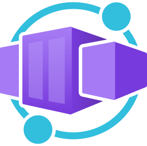

# 📦 Deploying to Azure Container Apps

Learn how to deploy containers to Azure Container Apps.

  

## Objectives

You'll learn how to:
- Create an Azure Container Apps environment
- Deploy a simple Go web application to Azure Container Apps
- Allow access to the web application with an external ingress
- Deploy revisions of the web application

## Prerequisites

| | |
|----------------------|------------------------------------------------------|
| Azure account        | [Get a free Azure account](https://azure.microsoft.com/free) |
| Azure CLI            | [Install Azure CLI](https://docs.microsoft.com/en-us/cli/azure/install-azure-cli) |
| Docker               | [Install Docker](https://docs.docker.com/get-docker/) |

## License

All workshop content is available under the [Creative Commons Attribution-ShareAlike 4.0 International License](http://creativecommons.org/licenses/by-sa/4.0/), meaning that you can share and modify it any way you want, as long as you credit the original authors and keep the modified content under the same license.

The source code of the various tools is available under the [MIT License](packages/website/LICENSE).
